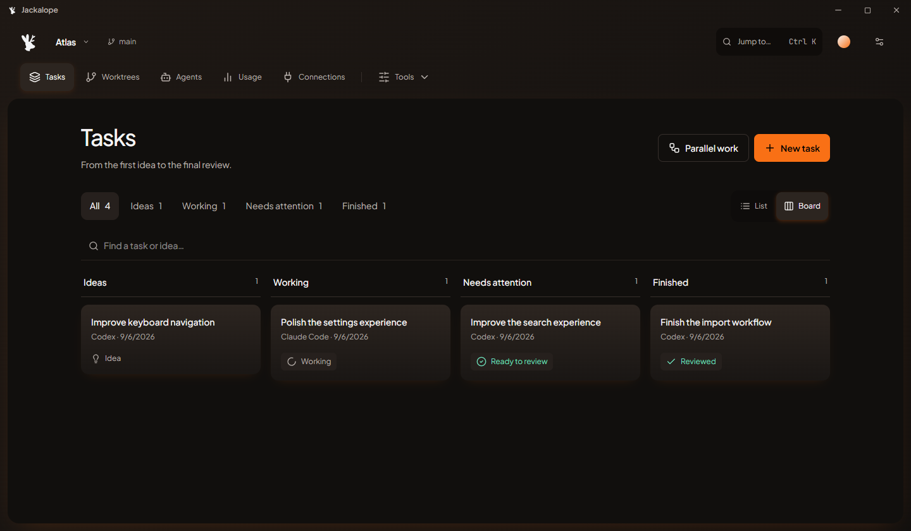

<p align="center">
  
</p>

# Jackalope

A desktop workspace for coding agents. Bring your installed agents and existing
sign-ins, run tasks in parallel Git worktrees, and review changes before merging.

[Website](https://jackalope.dev/) · [App tour](https://jackalope.dev/tour/) ·
[User guides](https://jackalope.dev/knowledge/) · [Documentation](docs/README.md) ·
[Contributing](CONTRIBUTING.md) · [Apache-2.0](LICENSE)

**Prerelease · coming soon for macOS, Windows and Linux.** You can build from source
today. Signed installers and platform acceptance remain in progress; see
[current status](docs/STATUS.md) and [release requirements](docs/CROSS-PLATFORM-RELEASES.md).
Joining the [waitlist](https://jackalope.dev/#newsletter) is optional for contributors.

<picture>
  <source media="(prefers-color-scheme: dark)" srcset="apps/website/public/media/tasks.png" />
  <source media="(prefers-color-scheme: light)" srcset="apps/website/public/media/tasks-light.png" />
  
</picture>

*Sample workspace with fictional projects and activity. [Watch the tour](https://jackalope.dev/tour/).*

## What you can do

- Work with Codex, Claude Code, Grok Build, OpenCode and Antigravity, with
  [provider-specific capabilities and limits](docs/AGENT-SUPPORT.md).
- Organize projects, tasks and saved ideas, then run parallel queues in isolated worktrees.
- Respond to agent questions, inspect results, run checks and review patches before integration.
- Connect MCP tools and task-owned browser sessions, and schedule recurring local work.
- Keep project guidance, codebase context, reported usage and recoverable task history together.
- Choose accounts and models, with capacity-aware routing and bounded quota handoff.

Agents use your own provider accounts and may incur provider charges. Worktrees
isolate Git changes, not the operating-system privileges of agents or tools.
Remote execution, monetary budgets and team collaboration remain future work;
see the [roadmap](docs/ROADMAP.md).

## Run from source

Install Node 24.18+ within Node 24 and pnpm 10.11.0. Native development also needs
Rust 1.98.1 and your platform's [Tauri prerequisites](https://v2.tauri.app/start/prerequisites/).
On Windows, install the MSVC C++ build tools and WebView2. Install and sign in to
the supported agent CLI you want to use.

```sh
git clone https://github.com/Jackalope-Dev/jackalope.git
cd jackalope
pnpm install --frozen-lockfile
pnpm tauri dev
```

For interface development, run `pnpm dev` for the desktop browser preview or
`pnpm dev:website` for the website. Run them in separate terminals on ports 5173
and 5180. The desktop browser preview cannot execute native tasks.

Contributor builds do not require a Jackalope cloud account, deployment secrets,
or a reporting endpoint. Official early-access builds can require approved
membership. See [privacy and reporting](docs/BETA-MONITORING.md).

Run `pnpm verify` before submitting changes. [CONTRIBUTING.md](CONTRIBUTING.md)
covers the toolchain, focused tests, secret checks and pull-request workflow.

## Find your way around

| Location | What lives here |
| --- | --- |
| [apps/desktop](apps/desktop) | React interface and Tauri/Rust task runtime |
| [apps/website](apps/website) | Product website, guides and sample media |
| [apps/server](apps/server) | Optional account, access, feedback and update service |
| [packages](packages) | Shared branding, knowledge and packages |
| [docs](docs/README.md) | User workflows, architecture and contributor reference |
| [scripts](scripts) | Verification, dependency notices and release tooling |

Start with [your first task](docs/GETTING-STARTED.md),
[the architecture](docs/ARCHITECTURE.md), or [contributor priorities](docs/TODO.md).
Fork operators should read [deployment and source boundaries](docs/DEPLOYMENT-AND-SOURCE.md)
before enabling signups or publishing a build.

## Get involved

[Report a bug or request a feature](https://github.com/Jackalope-Dev/jackalope/issues/new/choose),
join the [community](https://www.reddit.com/r/JackalopeDev/), or send a focused pull
request. Please follow our [community guidelines](CODE_OF_CONDUCT.md).
For private support, email [contact@jackalope.dev](mailto:contact@jackalope.dev).
Report vulnerabilities privately to [security@jackalope.dev](mailto:security@jackalope.dev);
see [SECURITY.md](SECURITY.md).

## License and privacy

Project-authored code, documentation and included media use [Apache-2.0](LICENSE),
except where a separate notice applies. Third-party packages and fonts retain
their own licenses. The copyright license does not grant trademark rights or
imply endorsement. See [licensing and redistribution](docs/LICENSING.md) and
the [dependency inventory](docs/DEPENDENCIES.md).

The [Privacy Policy](https://jackalope.dev/privacy/) and
[Terms of Service](https://jackalope.dev/terms/) cover Jackalope's hosted services.
Those terms do not replace or restrict the software's open-source license.
